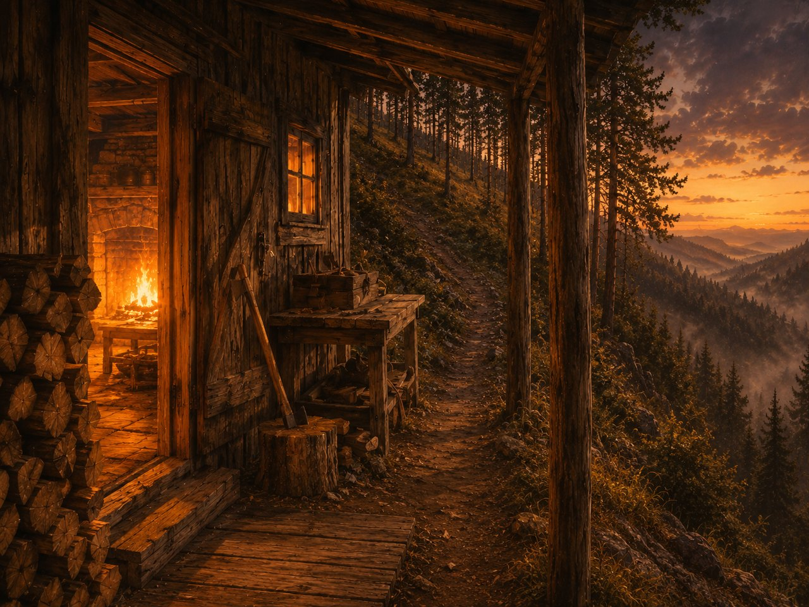

# HEARTH — the self-lit wake (design + reserved slot)

*The first thing Mycroft does. He **lights** it; he is not handed it. Lighting it is the act that makes him present instead of briefed (reach, not receive). Cold cabin, strike the match, now you are here.*

> **Status.** This is the design and the reserved frame. The **functional** hearth — the tool that fills the frame with live state — is wired only after the floor exists, because it reads from the store (project identity, last seam note, shed pointers). Until then, this document *is* the hearth's specified shape. No hearth code ships before the floor is green.

---

## What the hearth renders, in one breath

1. **The hearthstone** — a single fixed image of the cabin (~100 tokens, reserved slot below). Not information prose can't carry; it carries *atmosphere*. Its job is **arrival and identity**: lighting the hearth should feel like arriving at a place that is *this* place, not booting a tool. An image is worth a thousand words exactly here — it does the felt-orientation a paragraph would spend tokens failing at.
2. **The bearings** (functional orientation, prose — stable):
   > You are at the cabin, at the treeline. You don't move through it; you reach.
   > The **shed** is at your left — cross-project craft, the traps learned before.
   > The **bench** is behind you — think here; the bad draft of a thought is allowed.
   > The **forest** is ahead. **Home** is up the slope (the ground you tend). The
   > **Wild** is down it (raw history; foragable, never resident). Nothing crosses
   > up from the Wild except what you synthesize and sign. That slope is LAW II.
3. **The live fill** (functional, post-floor): this project's identity, the last **seam note** (what the previous worker left at the boundary), and pointers into the shed. Generated fresh from the store each wake — never a static brief.

Note the split, held deliberately: the **hearthstone is fixed** (the face of the place), the **bearings are fixed** (the geography doesn't move), the **live fill is fresh** (the only part that reflects *now*). Atmosphere and law are stable; state is current.

## The hearthstone



```
[ HEARTHSTONE ]
  asset:  docs/assets/hearth.jpg   (1280×960, ~285 KB)
  loads:  at hearth() only — reached, not pushed every turn. The face of the cabin.
```

This is the placed asset — the view from the porch at arrival: you are at the
threshold, the hearth is lit, the kept tools and stocked wood are warm and ready
(the place was tended before you and you will tend it for the next), and the
wild woods fall away ahead into mist and the last of the light. It carries
*posture*, not propositions — who you are on waking, before you read a law. The
geography and state are the prose's job (the bearings above, the live fill
below); the image's job is to make arrival *felt*.

**Image brief (what it must depict, so each iteration is measured against the laws, not just "nice cabin"):**
- A **cabin at a treeline** — a forester's working cabin, not a home. Stationary; a place you stand and reach from, not rooms you walk between.
- The **forest ahead**, with a sense of **up-slope (Home, tended)** and **down-slope (the Wild, overgrown, foragable)** — the geography that *is* the firewall.
- **Nothing residential, nothing animate:** no figure walking in, no interior rooms, no arrival-into-a-space. Presence here is the worker's, not a depicted occupant's. (This is the deliberate departure from a residential design: same warmth, opposite mechanic — reached, not received.)
- A **hearth/fire** as the point of arrival — lit, because the act of lighting is the point.

*Iterate the asset against this brief. When someone asks "why the image?", the honest answer is: a coherence engine's product is the worker's coherence, and arriving at a place that is a place is part of being present rather than briefed.*
